# WolfCash – Anleitung Adminoberfläche

Diese Anleitung beschreibt alle Bereiche der WolfCash-Adminoberfläche: Einrichtung von Speisekarte, Tischen und Druckern, laufende Kontrolle von Bestellungen und Stornos sowie den täglichen Abschluss.

> Die Screenshots zeigen Beispieldaten. Beträge, Produkte und Tische sind frei erfunden.

## Inhalt

1. [Anmelden und Navigation](#1-anmelden-und-navigation)
2. [Ersteinrichtung – empfohlene Reihenfolge](#2-ersteinrichtung--empfohlene-reihenfolge)
3. [Speisekarte](#3-speisekarte)
   - [Produktgruppen](#31-produktgruppen)
   - [Kategorien](#32-kategorien)
   - [Produkte](#33-produkte)
4. [Tische und QR-Codes](#4-tische-und-qr-codes)
5. [Bestellungen und Auswertungen](#5-bestellungen-und-auswertungen)
   - [Bestellungen](#51-bestellungen)
   - [Bestellung im Detail](#52-bestellung-im-detail)
   - [Stornos](#53-stornos)
   - [Tagesübersicht und Tagesabschluss](#54-tagesübersicht-und-tagesabschluss)
   - [Tagesabschlüsse (Historie)](#55-tagesabschlüsse-historie)
   - [Verkaufsstatistik](#56-verkaufsstatistik)
6. [Technik](#6-technik)
   - [Drucker](#61-drucker)
   - [Arbeitsplätze](#62-arbeitsplätze)
   - [Druckjobs](#63-druckjobs)
   - [Geräte](#64-geräte)
7. [Einstellungen](#7-einstellungen)
8. [System zurücksetzen](#8-system-zurücksetzen)
9. [Täglicher Ablauf – Checkliste](#9-täglicher-ablauf--checkliste)
10. [Wichtige Hinweise und bekannte Einschränkungen](#10-wichtige-hinweise-und-bekannte-einschränkungen)
11. [Anhang: Technische Voraussetzungen](#11-anhang-technische-voraussetzungen)

---

## 1. Anmelden und Navigation

### Anmelden

Rufe die Adresse des Kassensystems mit `/login` auf (z. B. `https://kassa.example.at/login`). Gib **E-Mail** und **Passwort** ein und klicke auf **Anmelden**. Stimmen die Daten nicht, erscheint „Login fehlgeschlagen.“.

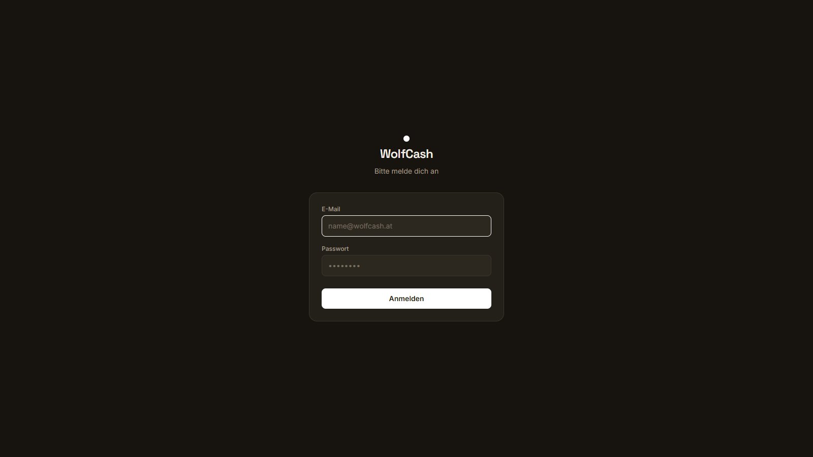

Nach erfolgreicher Anmeldung landest du auf der **Admin-Übersicht**. Dort führen zwei Kacheln direkt zur **Geräteverwaltung** bzw. zur Kasse (**POS öffnen**).

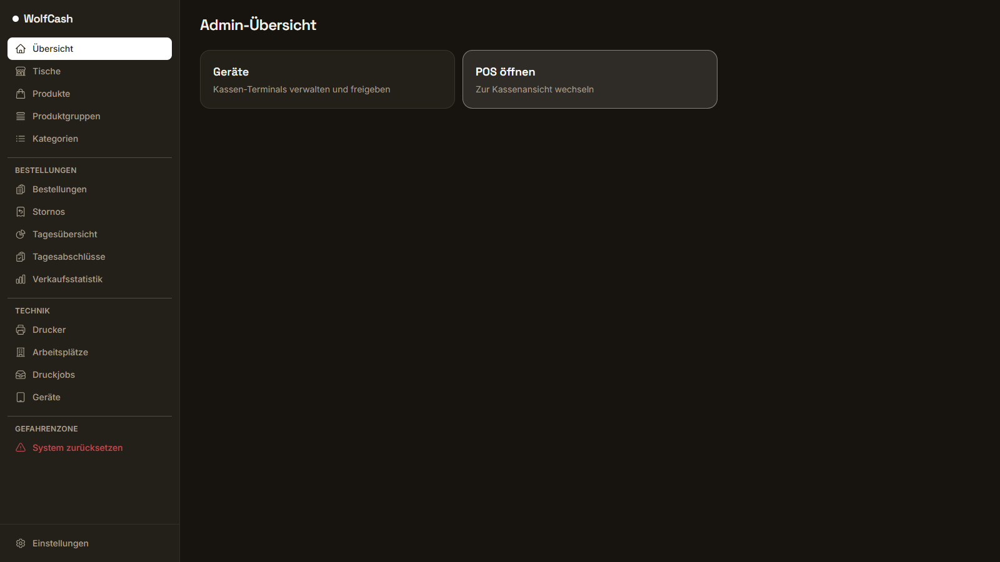

> **Hinweis:** Benutzerkonten werden derzeit nicht über die Oberfläche verwaltet. Neue Admin-Zugänge legt der Techniker direkt am Server an (siehe [Anhang](#11-anhang-technische-voraussetzungen)). Alle angemeldeten Benutzer haben die gleichen Rechte. Einen Abmelde-Button gibt es aktuell nicht – nach 120 Minuten Inaktivität läuft die Sitzung automatisch ab.

### Navigation

Die Menüleiste links ist in vier Bereiche gegliedert:

| Bereich | Menüpunkte |
|---|---|
| *(Stammdaten)* | Übersicht, Tische, Produkte, Produktgruppen, Kategorien |
| **Bestellungen** | Bestellungen, Stornos, Tagesübersicht, Tagesabschlüsse, Verkaufsstatistik |
| **Technik** | Drucker, Arbeitsplätze, Druckjobs, Geräte |
| **Gefahrenzone** | System zurücksetzen (rot) |

Unten in der Leiste öffnet **Einstellungen** ein kleines Menü mit **Allgemeine Einstellungen** und **Kasse öffnen**.

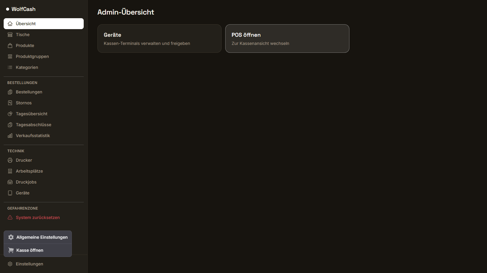

Auf Smartphone und Tablet ist das Menü eingeklappt. Du öffnest es über das **☰-Symbol** rechts oben.

<p>
  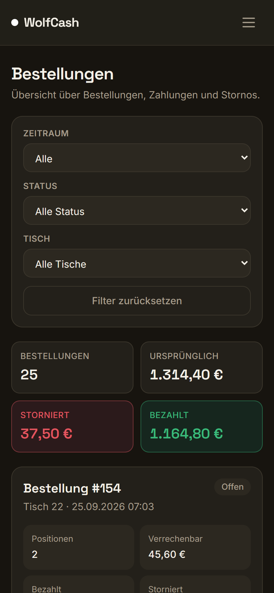
  &nbsp;
  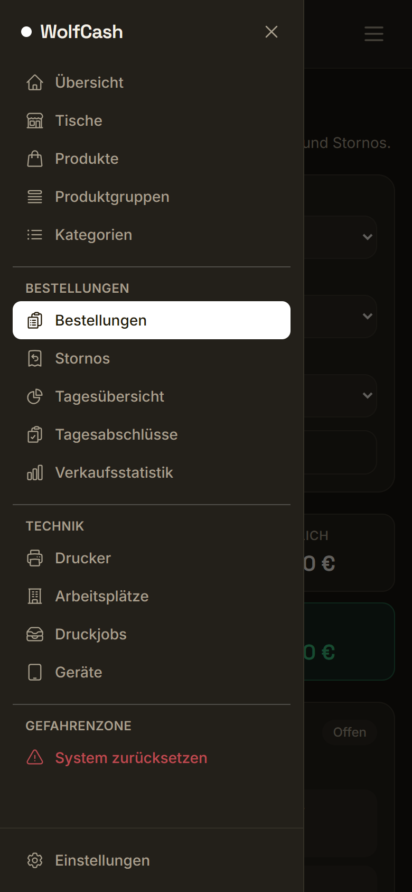
</p>

---

## 2. Ersteinrichtung – empfohlene Reihenfolge

Viele Einträge bauen aufeinander auf: Ein Produkt braucht eine Kategorie, eine Kategorie braucht eine Gruppe und legt fest, auf welchem Drucker und an welchem Arbeitsplatz gedruckt wird. Richte das System daher in dieser Reihenfolge ein:

| # | Schritt | Menü | Warum zuerst? |
|---|---|---|---|
| 1 | Drucker anlegen und Testdruck | Technik → Drucker | Wird in den Kategorien ausgewählt |
| 2 | Arbeitsplätze anlegen (z. B. Schank, Küche, Grill) | Technik → Arbeitsplätze | Ohne Arbeitsplatz wird **nichts gedruckt** |
| 3 | Produktgruppen anlegen (z. B. Getränke, Speisen) | Produktgruppen | Oberste Ebene der Speisekarte |
| 4 | Kategorien anlegen, Drucker und Arbeitsplatz zuordnen | Kategorien | Steuert den Bondruck |
| 5 | Produkte mit Preis, Druckmodus und Bestand anlegen | Produkte | – |
| 6 | Tische anlegen | Tische | – |
| 7 | Belegdruck und ggf. Self Ordering einstellen | Einstellungen | – |
| 8 | QR-Tischkarten erzeugen und drucken (nur bei Self Ordering) | Tische | – |
| 9 | Kassengeräte öffnen und freigeben | Technik → Geräte | – |

---

## 3. Speisekarte

Die Speisekarte hat drei Ebenen:

```
Produktgruppe   (z. B. Getränke)
 └─ Kategorie   (z. B. Bier)        → legt Drucker + Arbeitsplatz fest
     └─ Produkt (z. B. Märzen 0,5l) → Preis, Druckmodus, Bestand
```

### 3.1 Produktgruppen

**Menü:** Produktgruppen

Produktgruppen sind die oberste Ebene, meist „Getränke“ und „Speisen“. Die Reihenfolge wird auch in der Gäste-Bestellseite (Self Ordering) verwendet.

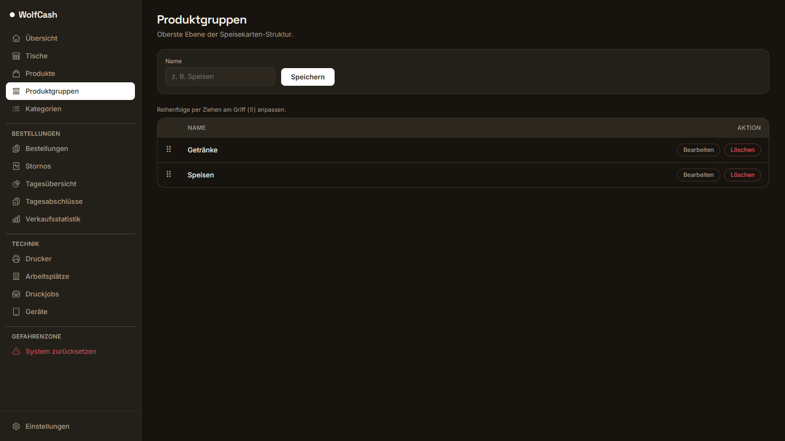

**So legst du eine Gruppe an:**

1. Namen eingeben (z. B. „Speisen“).
2. **Speichern** klicken.

**Bearbeiten:** **Bearbeiten** lädt den Namen ins Formular oben. Ändere ihn und klicke auf **Speichern**.

**Reihenfolge ändern:** Ziehe eine Zeile am Griff **⠿** an die gewünschte Position. Die Reihenfolge wird sofort gespeichert.

**Löschen:** Das geht nur, wenn der Gruppe keine Kategorien mehr zugeordnet sind. Es erfolgt **keine Sicherheitsabfrage**.

### 3.2 Kategorien

**Menü:** Kategorien (Seitentitel „Produktkategorien“)

Die Kategorie bestimmt, **wo** ein Produkt gedruckt und zubereitet wird.

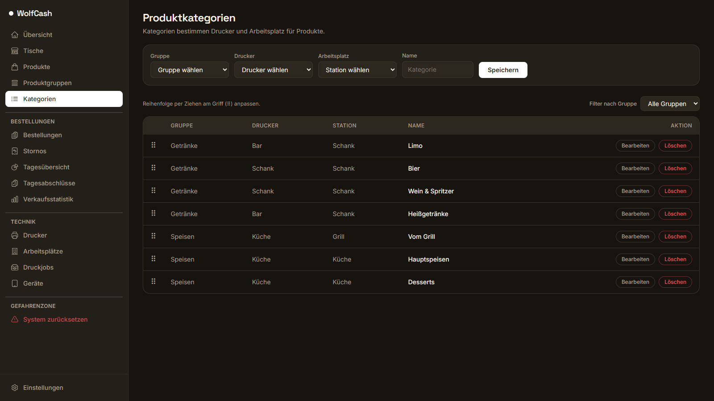

| Feld | Pflicht | Bedeutung |
|---|---|---|
| Gruppe | ja | Zugehörige Produktgruppe |
| Drucker | nein | Bondrucker, auf dem die Bestellbons gedruckt werden |
| Arbeitsplatz | nein* | Station in Küche/Schank (z. B. Grill) |
| Name | ja | z. B. „Bier“, „Vom Grill“ |

> **Wichtig – Arbeitsplatz nicht vergessen:** Bons werden **pro Arbeitsplatz** erstellt. Eine Kategorie **ohne Arbeitsplatz** erzeugt keinen Bon und erscheint nicht am Küchenmonitor – auch wenn ein Drucker ausgewählt ist. Hat sie einen Arbeitsplatz, aber keinen Drucker, erscheint die Bestellung nur am Küchenmonitor.

Mit **Filter nach Gruppe** blendest du nur die Kategorien einer Gruppe ein. Die Reihenfolge änderst du wie bei den Gruppen über den Griff **⠿**. Löschen ist nur möglich, wenn der Kategorie keine Produkte zugeordnet sind.

### 3.3 Produkte

**Menü:** Produkte

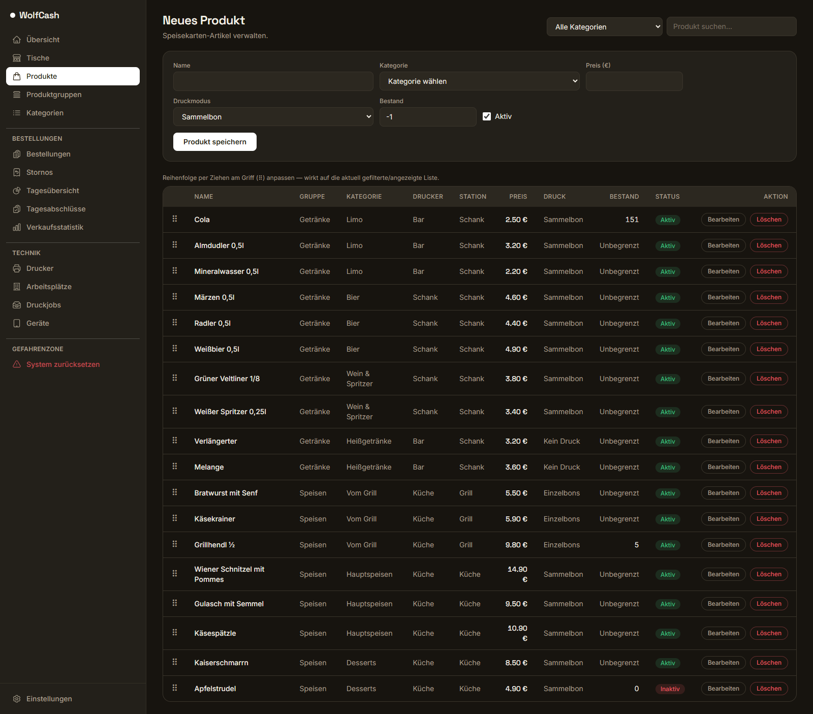

**So legst du ein Produkt an:**

1. **Name** eingeben.
2. **Kategorie** wählen.
3. **Preis (€)** eingeben (Bruttopreis, z. B. `4.60`).
4. **Druckmodus** wählen:
   - **Sammelbon** – alle Stück eines Produkts auf einem Bon (Standard).
   - **Einzelbons** – ein eigener Bon pro Stück (praktisch z. B. für Grillhendl, wenn jede Portion einzeln ausgegeben wird).
   - **Nicht drucken** – es wird kein Bon erzeugt (z. B. Kaffee, den der Kellner selbst macht).
5. **Bestand** eingeben:
   - `-1` = **unbegrenzt** (Standard).
   - Eine Zahl, z. B. `40`, wird bei jeder Bestellung heruntergezählt. Bei `0` ist das Produkt ausverkauft.
6. **Aktiv** angehakt lassen, damit das Produkt in der Kasse erscheint.
7. **Produkt speichern** klicken.

**Liste:** Die Tabelle zeigt pro Produkt Gruppe, Kategorie, den (von der Kategorie geerbten) Drucker und Arbeitsplatz, Preis, Druckmodus, Bestand und Status. Oben rechts filterst du nach Kategorie oder suchst nach dem Namen.

**Aktiv/Inaktiv:** Ein Klick auf den Status-Button schaltet um. Inaktive Produkte verschwinden aus Kasse und Self-Order-Seite, bleiben aber in allen Auswertungen erhalten.

> **Bestand und Reservierung:** Sobald ein Produkt in einem Warenkorb liegt (Kellner, Stationärkasse oder Gast), wird es reserviert. Abgebucht wird erst beim Bonieren bzw. nach erfolgreicher Online-Zahlung. Nicht abgeschlossene Reservierungen verfallen nach 15 Minuten.

> ⚠️ **Produkte nicht löschen, sondern deaktivieren!** **Löschen** hat keine Sicherheitsabfrage und entfernt das Produkt **aus allen bisherigen Bestellungen**. Dadurch ändern sich Bestellhistorie und Statistiken rückwirkend. Setze Produkte, die nicht mehr verkauft werden, einfach auf **Inaktiv**.

---

## 4. Tische und QR-Codes

**Menü:** Tische (Seitentitel „Tischverwaltung“)

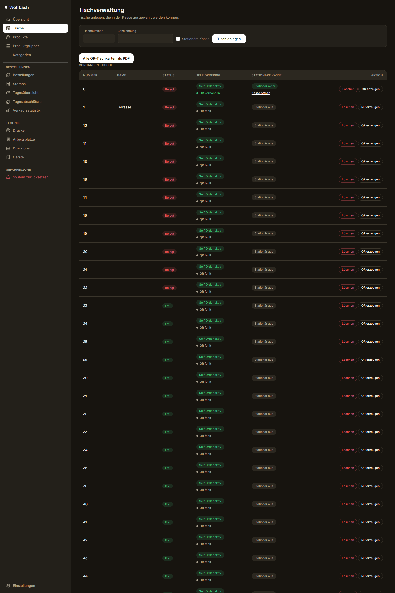

### Tisch anlegen

| Feld | Pflicht | Bedeutung |
|---|---|---|
| Tischnummer | ja | Freitext, max. 20 Zeichen (z. B. `12`, `T3`, `Bar`) |
| Bezeichnung | nein | z. B. „Terrasse“ |
| Stationäre Kasse | nein | Tisch dient als fest installierte Kasse (z. B. Schankverkauf) |

Klicke auf **Tisch anlegen**. Neue Tische sind sofort in der Kasse wählbar, Self Ordering ist für sie automatisch aktiviert. Nachträglich umbenennen lässt sich ein Tisch derzeit nicht – im Zweifel löschen und neu anlegen.

### Spalten und Schalter in der Liste

- **Status** – „Frei“ oder „Belegt“ (nur Anzeige).
- **Self Ordering** – Schalter **Self Order aktiv / aus** für diesen Tisch, darunter „QR vorhanden“ bzw. „QR fehlt“.
- **Stationäre Kasse** – Schalter **Stationär aktiv / aus**. Wenn aktiv, öffnet der Link **Kasse öffnen** die stationäre Kasse dieses Tisches in einem neuen Tab. Bestellungen einer stationären Kasse werden immer auf dem eigens dafür konfigurierten Drucker gedruckt.
- **Aktion** – **Löschen** (mit Sicherheitsabfrage) und **QR erzeugen / QR anzeigen**.

> ⚠️ **Beim Löschen eines Tisches werden alle Bestellungen dieses Tisches mitgelöscht** – samt Positionen und Zahlungen. Lösche Tische daher nur vor dem Betrieb oder im Zuge eines System-Resets.

### QR-Codes für Self Ordering

Mit **QR erzeugen** bzw. **QR anzeigen** öffnet sich das QR-Fenster des Tisches:

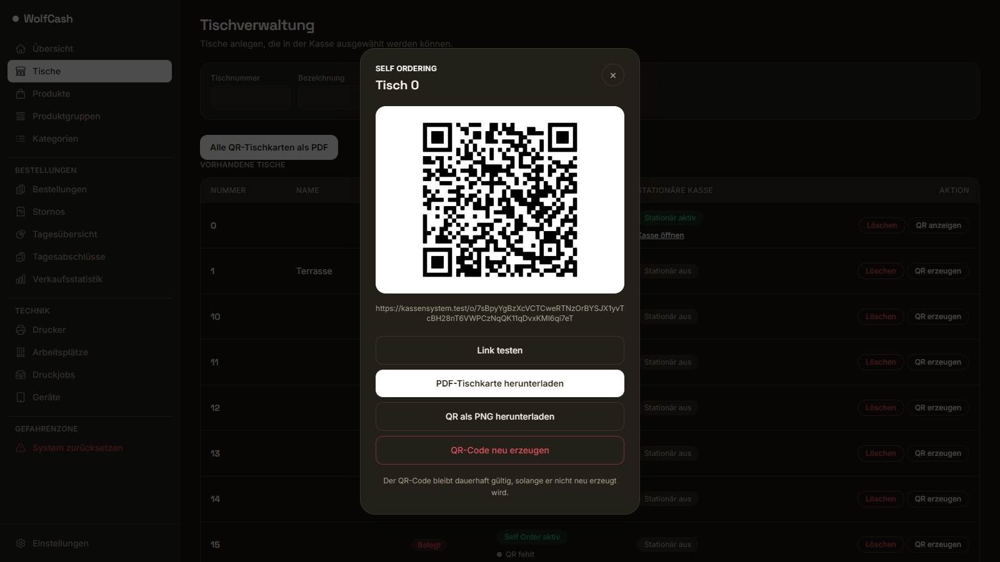

| Schaltfläche | Funktion |
|---|---|
| **Link testen** | Öffnet die Gäste-Bestellseite des Tisches in einem neuen Tab |
| **PDF-Tischkarte herunterladen** | Tischaufsteller im Format A6 mit Überschrift, Tischnummer und QR-Code |
| **QR als PNG herunterladen** | Dieselbe Karte als Bilddatei (300 dpi), z. B. für eigene Layouts |
| **QR-Code neu erzeugen** | Erzeugt einen neuen Code. **Der alte Code funktioniert danach nicht mehr** – die Tischkarte muss neu gedruckt werden. |

Ein QR-Code bleibt dauerhaft gültig, solange er nicht neu erzeugt wird. Über **Alle QR-Tischkarten als PDF** (oberhalb der Tabelle) lädst du die Karten aller Tische mit aktivem Self Ordering und vorhandenem QR-Code in einer Datei herunter. Tische ohne QR-Code werden dabei übersprungen – öffne bei diesen vorher einmal **QR erzeugen**.

Überschrift und Untertitel der Karten legst du unter [Einstellungen](#7-einstellungen) fest. Damit Gäste bestellen können, muss Self Ordering **sowohl in den Einstellungen als auch beim Tisch** aktiviert sein.

---

## 5. Bestellungen und Auswertungen

Die Seiten in diesem Bereich dienen der Kontrolle. Bestellungen, Zahlungen und Stornos selbst werden in der Kasse (POS) erfasst – nicht in der Adminoberfläche.

### 5.1 Bestellungen

**Menü:** Bestellungen → Bestellungen

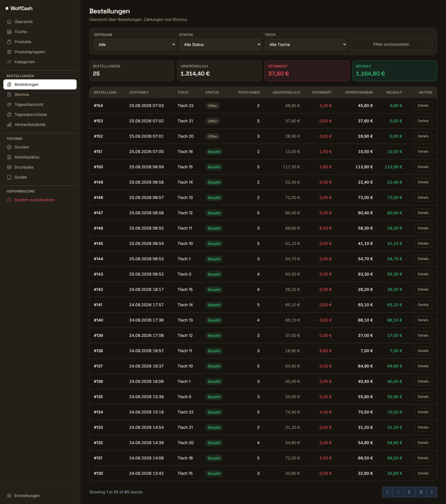

**Filter:**

- **Zeitraum** – Heute (Standard), Gestern, Diese Woche, Dieser Monat, Alle.
- **Status** – Offen, Boniert, Bezahlt, Storniert.
- **Tisch**.
- **Filter zurücksetzen** stellt alles auf den Standard zurück.

**Kennzahlen oben:** Anzahl Bestellungen sowie Summen der Beträge *Ursprünglich*, *Storniert* und *Bezahlt*.

> Die Summen beziehen sich nur auf die aktuell angezeigte Seite (25 Bestellungen). Für Tagessummen verwende die [Tagesübersicht](#54-tagesübersicht-und-tagesabschluss).

**Begriffe:**

| Begriff | Bedeutung |
|---|---|
| Ursprünglich | Wert aller bonierten Positionen vor Stornos |
| Storniert | Wert der stornierten Positionen |
| Verrechenbar | Ursprünglich minus Storniert – das, was der Gast zahlen muss |
| Bezahlt | Tatsächlich kassierter Betrag |

Bestellungen von Gästen über den QR-Code tragen das Kennzeichen **Self Order**. Mit **Details** öffnest du eine Bestellung.

### 5.2 Bestellung im Detail

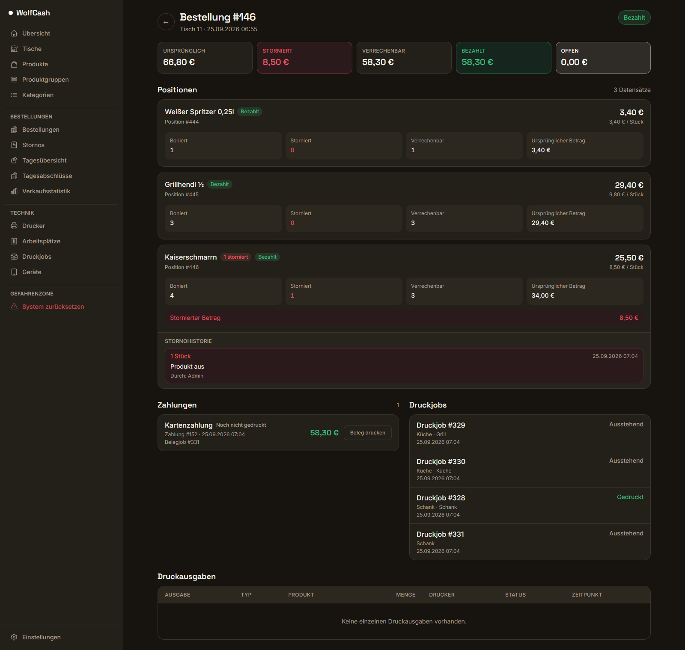

Die Detailseite zeigt:

- **Kennzahlen** – Ursprünglich, Storniert, Verrechenbar, Bezahlt, Offen.
- **Positionen** – jede Position mit bonierter, stornierter und verrechenbarer Menge. Bei stornierten Positionen gibt es eine **Stornohistorie** mit Menge, Zeitpunkt, Grund und Mitarbeiter.
- **Zahlungen** – Zahlungsart (Barzahlung, Kartenzahlung, Gutschein, Rechnung, Auf Haus), Belegstatus und der Button **Beleg drucken**.
- **Druckjobs** – welche Bons an welchen Drucker/Arbeitsplatz gingen und ob sie gedruckt wurden.
- **Druckausgaben** – einzelne Belegausdrucke (Zahlungsbeleg, Belegkopie, Storno, Produktion).

**Beleg nachdrucken:** Klicke bei der Zahlung auf **Beleg drucken** und bestätige die Rückfrage. Nachdrucke werden als **Belegkopie** gekennzeichnet. Der Button ist ausgegraut, wenn der manuelle Belegdruck in den Einstellungen deaktiviert ist oder für ältere Zahlungen kein Beleg gespeichert wurde.

### 5.3 Stornos

**Menü:** Bestellungen → Stornos

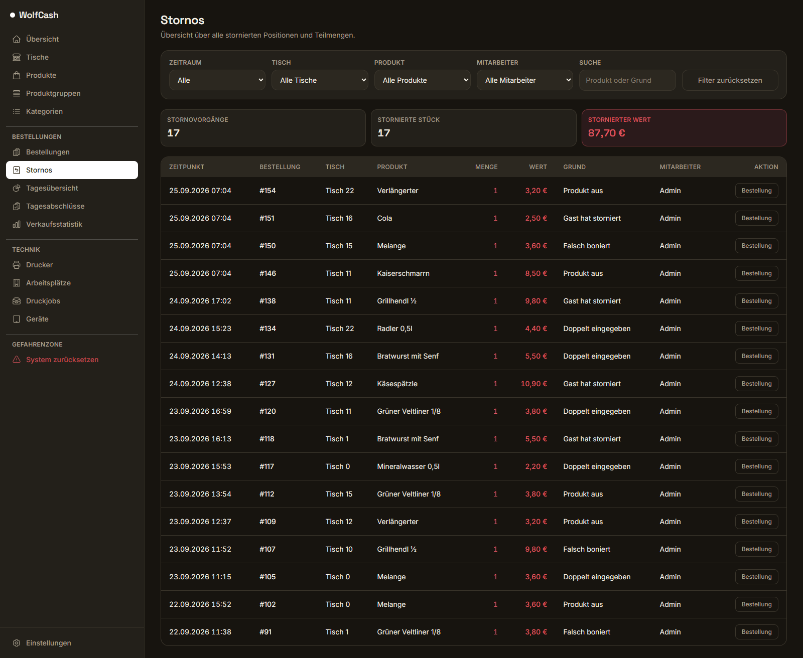

Hier findest du alle stornierten Positionen und Teilmengen. Du kannst nach **Zeitraum**, **Tisch**, **Produkt** und **Mitarbeiter** filtern oder im Feld **Suche** nach Produkt oder Stornogrund suchen. Die Kennzahlen (Stornovorgänge, stornierte Stück, stornierter Wert) gelten für **alle** gefilterten Stornos. Über **Bestellung** springst du zur zugehörigen Bestellung.

### 5.4 Tagesübersicht und Tagesabschluss

**Menü:** Bestellungen → Tagesübersicht

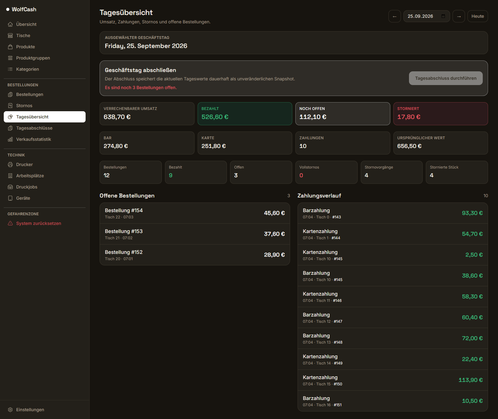

**Tag wählen:** Mit **←** und **→** blätterst du tageweise, über das Datumsfeld springst du zu einem bestimmten Tag, **Heute** kehrt zum aktuellen Tag zurück.

**Kennzahlen:**

- Verrechenbarer Umsatz, Bezahlt, Noch offen, Storniert.
- Bar, Karte, Anzahl Zahlungen, Ursprünglicher Wert.
- Bestellungen gesamt / bezahlt / offen, Vollstornos, Stornovorgänge, stornierte Stück.

Darunter stehen die **offenen Bestellungen** (anklickbar) und der **Zahlungsverlauf** des Tages.

#### Tagesabschluss durchführen

Der Tagesabschluss speichert alle Tageswerte **dauerhaft und unveränderlich** als Snapshot.

1. Prüfe unter **Offene Bestellungen**, ob noch etwas offen ist, und kassiere diese Bestellungen in der Kasse ab. Solange offene Bestellungen existieren, ist der Button gesperrt („Es sind noch N Bestellungen offen.“).
2. Klicke auf **Tagesabschluss durchführen**.
3. Bestätige die Rückfrage „… wirklich abschließen? Dieser Vorgang kann nicht rückgängig gemacht werden.“

Nach dem Abschluss zeigt die Seite **✓ Geschäftstag abgeschlossen** mit Abschlussnummer, Zeitpunkt und Benutzer:

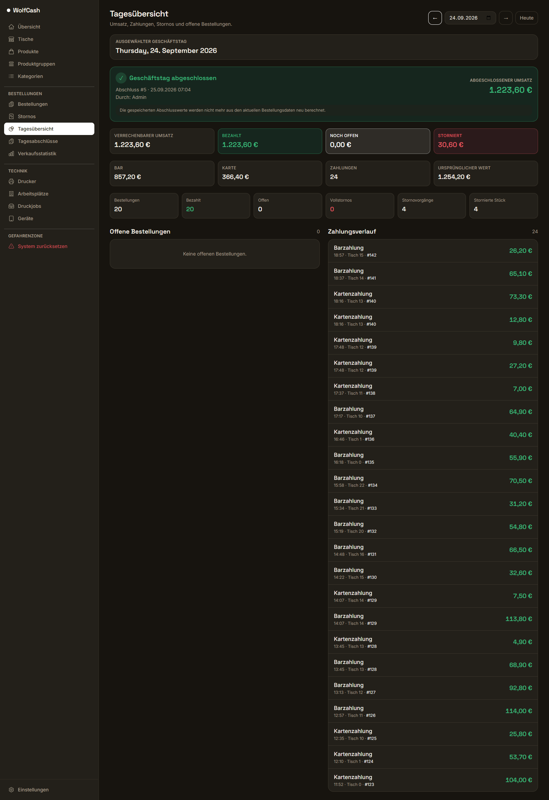

> ⚠️ **Heutigen Tag erst nach Betriebsende abschließen!** Nach dem Abschluss des *aktuellen* Tages sind bis Mitternacht **keine weiteren Bestellungen, Zahlungen oder Stornos** mehr möglich – auch nicht über Self Ordering. Ein Abschluss kann nicht rückgängig gemacht werden. Zukünftige Tage lassen sich nicht abschließen.

### 5.5 Tagesabschlüsse (Historie)

**Menü:** Bestellungen → Tagesabschlüsse

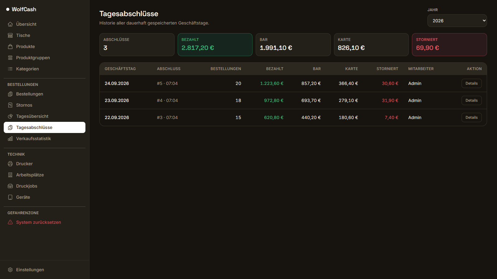

Liste aller abgeschlossenen Geschäftstage mit Bestellungen, Bezahlt, Bar, Karte, Storniert und dem abschließenden Mitarbeiter. Über **Jahr** filterst du nach Jahr. Die Kennzahlen oben summieren alle angezeigten Abschlüsse – praktisch z. B. für die Gesamtabrechnung einer Veranstaltung.

**Details** öffnet den gespeicherten Snapshot mit allen Bestellungen, Zahlungen und Stornos dieses Tages:

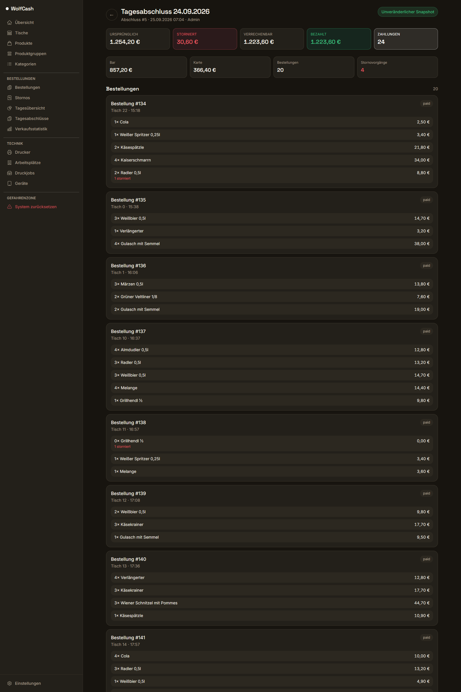

Die Werte eines Abschlusses werden nie neu berechnet – auch dann nicht, wenn sich später Stammdaten (z. B. Produktnamen) ändern.

### 5.6 Verkaufsstatistik

**Menü:** Bestellungen → Verkaufsstatistik (Seitentitel „Produktauswertung“)

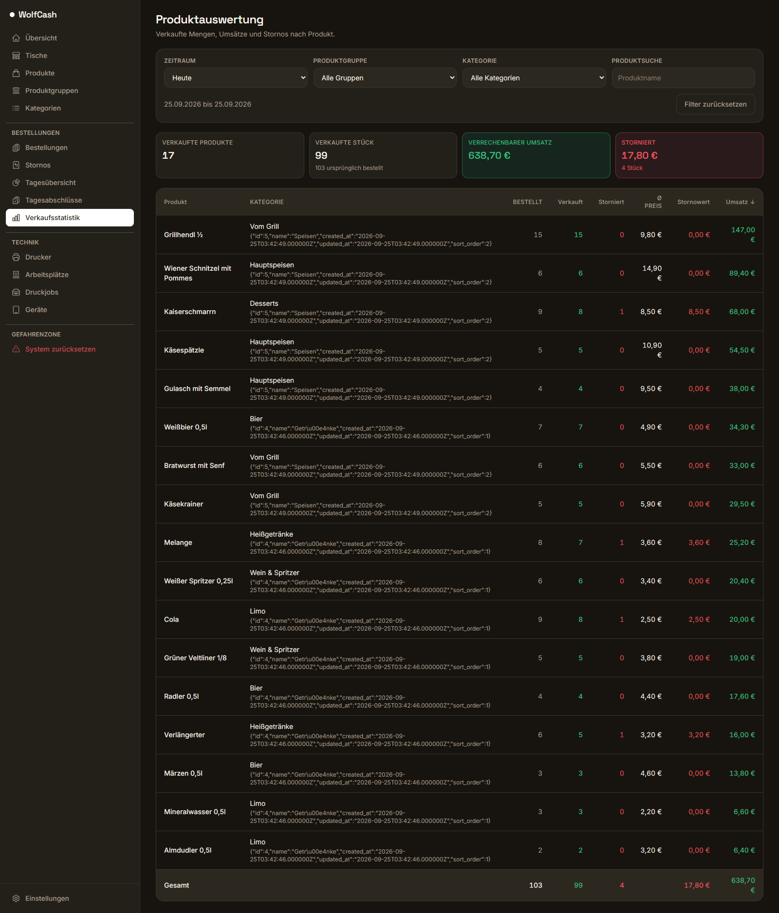

Zeigt pro Produkt die bestellte, verkaufte und stornierte Menge, den Durchschnittspreis, den Stornowert und den Umsatz – mit Gesamtzeile.

- **Zeitraum** – Heute, Gestern, Diese Woche, Dieser Monat, Dieses Jahr oder **Benutzerdefiniert** (mit Von/Bis-Datum).
- **Kategorie** und **Produktsuche** schränken die Liste ein.
- Die Spalten **Produkt**, **Verkauft**, **Storniert**, **Stornowert** und **Umsatz** lassen sich per Klick sortieren (↑/↓).

> **Bekannter Fehler (Stand dieser Anleitung):** Unter dem Kategorienamen wird statt des Gruppennamens ein technischer Datensatz angezeigt (siehe Screenshot). Der Filter **Produktgruppe** funktioniert derzeit nicht zuverlässig – bitte stattdessen nach **Kategorie** filtern.

---

## 6. Technik

### 6.1 Drucker

**Menü:** Technik → Drucker

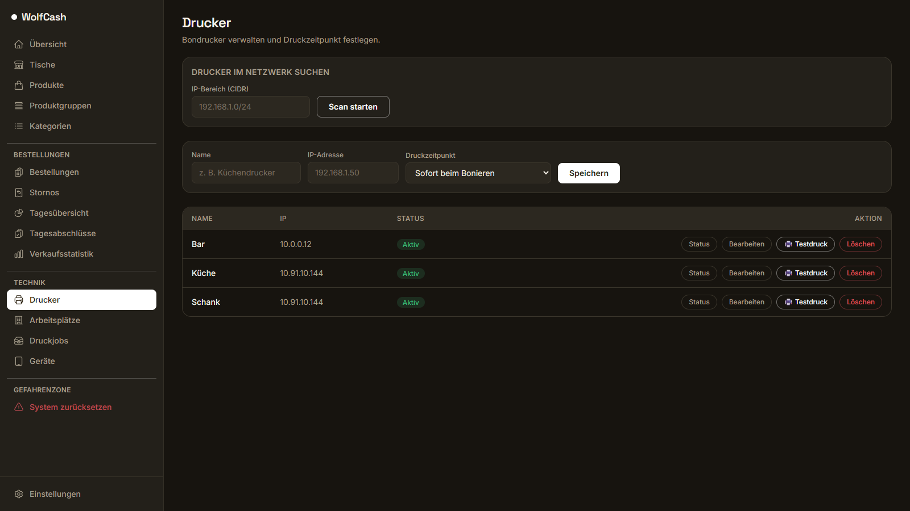

#### Drucker im Netzwerk suchen

1. Unter **Drucker im Netzwerk suchen** den **IP-Bereich** prüfen. Er ist mit dem Netz des Servers vorbelegt, z. B. `192.168.1.0/24`.
2. **Scan starten** klicken. Ein Fortschrittsbalken zeigt den Stand.
3. Gefundene Bondrucker (Port 9100) werden aufgelistet. **Übernehmen** trägt IP und Port ins Formular ein. Bereits angelegte Drucker sind als „Bereits angelegt“ markiert.

#### Drucker anlegen oder bearbeiten

| Feld | Bedeutung |
|---|---|
| Name | z. B. „Küchendrucker“ |
| IP-Adresse | IP des Bondruckers im Netzwerk |
| Druckzeitpunkt | Wann der Bon gedruckt wird (siehe unten) |

**Druckzeitpunkt:**

- **Sofort beim Bonieren** – der Bon wird gedruckt, sobald der Kellner die Bestellung abschickt (Standard, üblich für Schank und Bar).
- **Erst wenn der gesamte Bon fertig ist** – gedruckt wird, wenn am Küchenmonitor der ganze Bon als fertig markiert wurde (z. B. als Ausgabebon).
- **Sobald eine Position fertig ist** – gedruckt wird je Position, sobald sie am Küchenmonitor fertig ist.

Nach **Speichern** erscheint der Drucker in der Liste. Dort stehen folgende Aktionen zur Verfügung:

- **Status** – schaltet den Drucker aktiv/inaktiv.
- **Bearbeiten**.
- **🖨 Testdruck** – sendet sofort eine Testseite und meldet Erfolg oder Fehler.
- **Löschen** – nur möglich, wenn keine Kategorie den Drucker verwendet und er noch nie gedruckt hat.

> Mache nach dem Anlegen immer einen **Testdruck**. Schlägt er fehl, prüfe IP-Adresse, Netzwerkkabel/WLAN und ob der Drucker eingeschaltet ist.

### 6.2 Arbeitsplätze

**Menü:** Technik → Arbeitsplätze (Seitentitel „Produktionsstationen“)

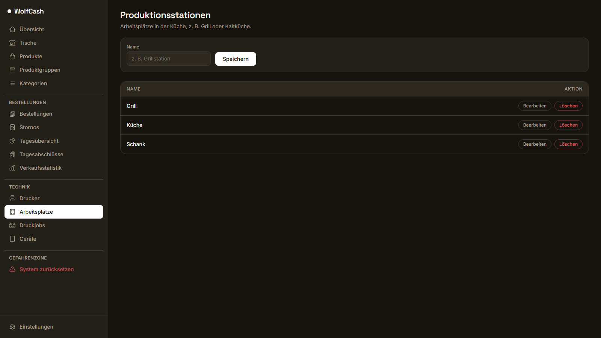

Arbeitsplätze sind die Stationen, an denen Bestellungen zubereitet werden, z. B. *Schank*, *Küche*, *Grill*, *Kaltküche*. Namen eingeben und **Speichern** klicken.

- Arbeitsplätze werden in den [Kategorien](#32-kategorien) zugeordnet.
- Am **Küchenmonitor** (`/production`) erscheinen sie als Filter. Dort markiert das Küchenpersonal Positionen oder ganze Bons als fertig.
- Löschen ist nur möglich, wenn keine Kategorie den Arbeitsplatz verwendet.

### 6.3 Druckjobs

**Menü:** Technik → Druckjobs

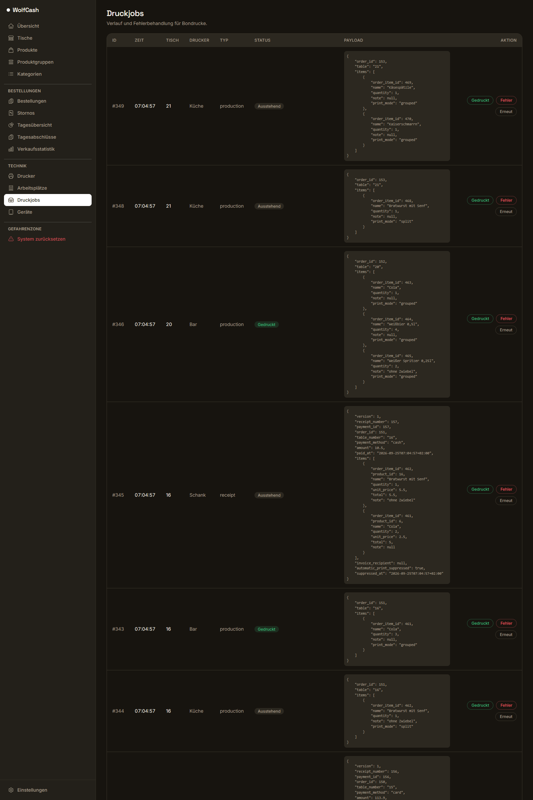

Hier siehst du alle Bon- und Belegdrucke mit Zeit, Tisch, Drucker, Typ und Status:

| Status | Bedeutung |
|---|---|
| Ausstehend | Wartet auf den Druck (bzw. auf „fertig“ am Küchenmonitor) |
| Druckt… | Wird gerade gesendet |
| Gedruckt | Erfolgreich gedruckt |
| Fehler | Druck fehlgeschlagen – die Fehlermeldung steht unter dem Status |

**Aktionen:**

- **Erneut** – stellt einen fehlgeschlagenen Job erneut in die Warteschlange (z. B. nachdem Papier nachgelegt wurde).
- **Gedruckt** – markiert einen Job als erledigt, ohne zu drucken (z. B. wenn der Bon handschriftlich weitergegeben wurde).
- **Fehler** – markiert einen hängenden Job manuell als fehlgeschlagen.

### 6.4 Geräte

**Menü:** Technik → Geräte (Seitentitel „Geräteverwaltung“)

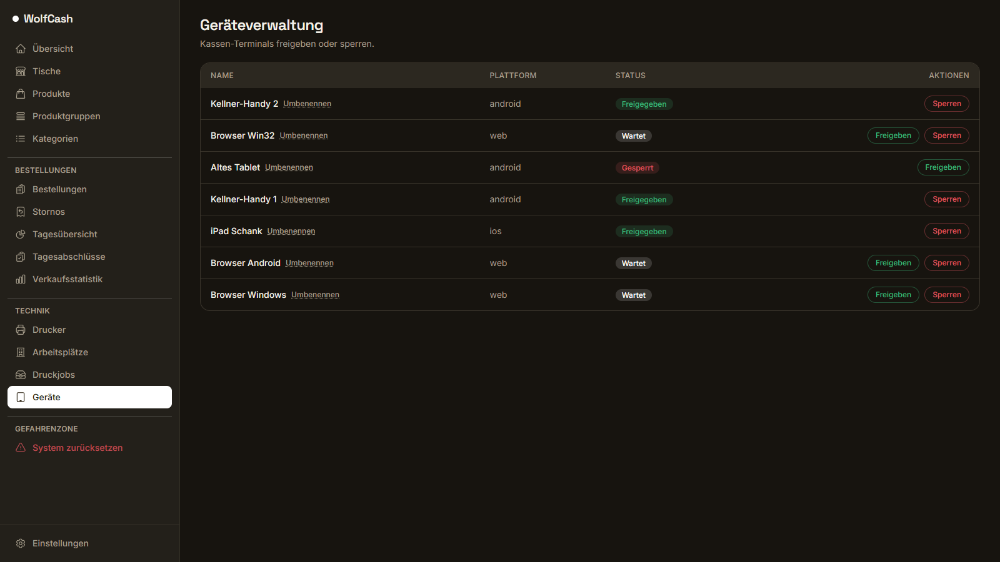

Jedes Tablet oder Handy, das die Kasse öffnet, meldet sich hier automatisch an und erscheint mit Status **Wartet**. Manuell anlegen kann man Geräte nicht.

| Aktion | Wirkung |
|---|---|
| **Freigeben** | Gerät darf die Kasse benutzen. Die WolfCash-App erhält erst jetzt ihren Zugangsschlüssel. |
| **Sperren** | Gerät wird blockiert (z. B. bei Verlust eines Handys) |
| **Umbenennen** | Sprechenden Namen vergeben, z. B. „Kellner-Handy 1“ (mit Enter oder **Speichern** bestätigen) |

**Neues Gerät einrichten:**

1. Am Gerät die Kasse im Browser öffnen (`/pos`) oder die WolfCash-App starten.
2. In der Adminoberfläche unter **Geräte** das neue Gerät mit Status **Wartet** suchen.
3. **Umbenennen**, dann **Freigeben**.

> Geräte lassen sich derzeit nicht löschen – nicht mehr benötigte Geräte bitte **sperren**.

---

## 7. Einstellungen

**Menü:** Einstellungen (unten links) → Allgemeine Einstellungen

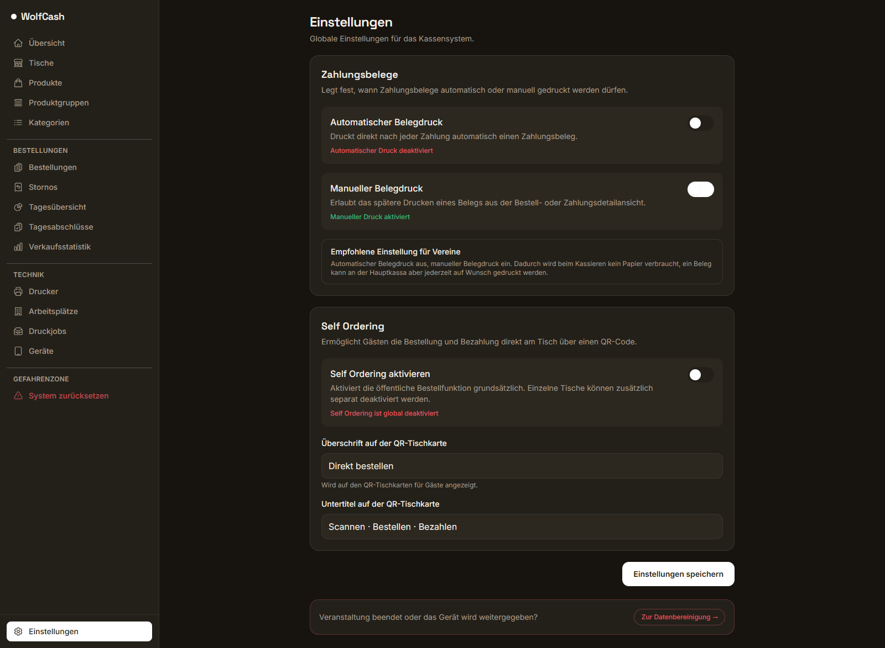

### Zahlungsbelege

| Schalter | Wirkung | Standard |
|---|---|---|
| **Automatischer Belegdruck** | Druckt nach jeder Zahlung automatisch einen Beleg | ein |
| **Manueller Belegdruck** | Erlaubt das spätere Drucken über **Beleg drucken** in den Bestelldetails | ein |

Empfehlung für Vereinsfeste: automatischen Belegdruck **aus**, manuellen Belegdruck **ein** – so wird nur auf Wunsch des Gastes gedruckt.

### Self Ordering

| Einstellung | Bedeutung |
|---|---|
| **Self Ordering aktivieren** | Schaltet die Bestellung per QR-Code für das gesamte System ein oder aus (Standard: aus) |
| **Überschrift auf der QR-Tischkarte** | max. 80 Zeichen, Standard „Direkt bestellen“ |
| **Untertitel auf der QR-Tischkarte** | max. 120 Zeichen, Standard „Scannen · Bestellen · Bezahlen“ |

Gäste bestellen und bezahlen über die QR-Seite direkt online per Karte (Stripe). Die Bestellung erscheint danach als bezahlte **Self Order** in der Kasse, und die Bons werden automatisch gedruckt.

Änderungen werden erst mit **Einstellungen speichern** wirksam.

---

## 8. System zurücksetzen

**Menü:** Gefahrenzone → System zurücksetzen

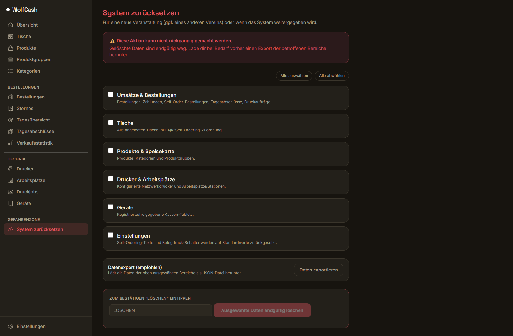

Dieser Bereich ist für das Ende einer Veranstaltung gedacht oder wenn das System an einen anderen Verein weitergegeben wird.

> ⚠️ **Gelöschte Daten sind endgültig weg.** Exportiere vorher die Daten und prüfe, ob Aufbewahrungspflichten bestehen (z. B. für Tagesabschlüsse).

**Auswählbare Bereiche:**

| Bereich | Was wird gelöscht |
|---|---|
| Umsätze & Bestellungen | Bestellungen, Positionen, Stornos, Zahlungen, Self-Order-Bestellungen, Druckaufträge, **Tagesabschlüsse** und **alle QR-Codes** |
| Tische | Alle Tische |
| Produkte & Speisekarte | Produkte, Kategorien, Produktgruppen |
| Drucker & Arbeitsplätze | Drucker und Arbeitsplätze |
| Geräte | Alle registrierten Geräte |
| Einstellungen | Alle Einstellungen auf Standardwerte |

Neben jedem Bereich wird angezeigt, wie viele Einträge betroffen sind. Wählst du *Tische*, *Produkte* oder *Drucker*, wird *Umsätze & Bestellungen* automatisch mit ausgewählt. **Benutzerkonten werden nie gelöscht.**

Die fortlaufenden Nummern der gelöschten Bereiche werden ebenfalls zurückgesetzt – nach einem Reset von *Umsätze & Bestellungen* beginnt die nächste Bestellung wieder bei **#1**.

**Ablauf:**

1. Bereiche anhaken (oder **Alle auswählen**).
2. **Daten exportieren** klicken – lädt eine JSON-Datei mit den ausgewählten Daten herunter. Bitte gut aufbewahren; ein Wiederherstellen über die Oberfläche ist nicht möglich.
3. Im Bestätigungsfeld exakt `LÖSCHEN` eintippen.
4. **Ausgewählte Daten endgültig löschen** klicken und die Rückfrage bestätigen.

> Auch wenn nur *Umsätze & Bestellungen* zurückgesetzt wird, werden alle QR-Codes ungültig. Die Tischkarten müssen danach neu erzeugt und gedruckt werden.

---

## 9. Täglicher Ablauf – Checkliste

**Vor Betriebsbeginn**

- [ ] Drucker eingeschaltet, Papier eingelegt – bei Bedarf **Testdruck** unter *Drucker*
- [ ] Neue Kassengeräte unter *Geräte* freigegeben
- [ ] Ausverkaufte oder neue Produkte unter *Produkte* aktiviert/deaktiviert, Bestände gesetzt
- [ ] Self Ordering in den *Einstellungen* ein- bzw. ausgeschaltet

**Während des Betriebs**

- [ ] Gelegentlich *Druckjobs* auf **Fehler** prüfen und mit **Erneut** nachdrucken
- [ ] Bei Rückfragen die Bestellung unter *Bestellungen → Details* öffnen

**Nach Betriebsende**

- [ ] *Tagesübersicht*: alle **offenen Bestellungen** in der Kasse abkassieren
- [ ] Barbestand mit dem Wert **Bar** abgleichen
- [ ] **Tagesabschluss durchführen**

---

## 10. Wichtige Hinweise und bekannte Einschränkungen

- **Löschen ohne Rückfrage:** Produktgruppen, Kategorien, Produkte, Drucker und Arbeitsplätze werden ohne Sicherheitsabfrage gelöscht.
- **Produkt löschen verändert die Historie:** Die Bestellpositionen des Produkts werden mitgelöscht. Besser **Inaktiv** setzen.
- **Tisch löschen löscht dessen Bestellungen.**
- **Tagesabschluss sperrt den aktuellen Tag** bis Mitternacht.
- **Keine Registrierkassen-Signatur (RKSV):** WolfCash erstellt derzeit keine signierten Belege und keinen RKSV-Nullbeleg. Der Tagesabschluss ist ein interner Bericht. Kläre mit deinem Steuerberater, ob das für deinen Einsatz ausreicht.
- **Benutzerverwaltung:** Es gibt keine Rollen, keine Benutzerverwaltung in der Oberfläche, kein Abmelden und kein „Passwort vergessen“.
- **Kasse und Küchenmonitor ohne Anmeldung:** `/pos` und `/production` sind ohne Login erreichbar, und die Gerätefreigabe wird im Browser derzeit nicht erzwungen. Betreibe das System daher nur in einem geschützten Netzwerk.
- **Bestellübersicht:** Die Summen oben gelten nur für die aktuelle Seite.
- **Verkaufsstatistik:** Der Filter *Produktgruppe* ist fehlerhaft (siehe [5.6](#56-verkaufsstatistik)).
- **Datumsanzeige:** Wochentage und Monatsnamen erscheinen teils auf Englisch (z. B. „Friday“).

---

## 11. Anhang: Technische Voraussetzungen

*Für Techniker/Betreiber des Servers.*

**Hintergrundprozesse** – müssen dauerhaft laufen, sonst wird nicht gedruckt:

```bash
php artisan schedule:work   # Druckverarbeitung (alle 5 s), Freigabe von Reservierungen
php artisan queue:work      # Druckersuche und Druckaufträge
```

**Wichtige `.env`-Einstellungen**

| Variable | Bedeutung |
|---|---|
| `APP_URL` | Öffentliche Adresse des Systems |
| `PRINT_DRIVER` | `escpos_network` für echte Drucker; `simulation` druckt nichts (Test) |
| `PRINT_RECEIPT_PRINTER_ID` | ID des Druckers für Zahlungsbelege (muss aktiv sein) |
| `PRINT_STATIONARY_PRINTER_ID` | ID des Druckers für Bestellungen von stationären Kassen |
| `PRINT_NETWORK_TIMEOUT` | Timeout für Netzwerkdrucker in Sekunden (Standard 5) |
| `SELF_ORDER_BASE_URL` | Adresse in den QR-Codes – muss öffentlich per HTTPS erreichbar sein |
| `STRIPE_SECRET_KEY`, `STRIPE_WEBHOOK_SECRET` | Zugangsdaten für die Online-Zahlung beim Self Ordering |
| `MOBILE_WEB_URL` | Basisadresse für die Anmeldung der WolfCash-App |

Die Drucker-ID steht in der Datenbank-Tabelle `printers` (Spalte `id`).

**Stripe:** Im Stripe-Dashboard einen Webhook auf `https://<adresse>/stripe/webhook` einrichten, mit den Ereignissen `checkout.session.completed`, `checkout.session.async_payment_succeeded` und `checkout.session.async_payment_failed`.

**Admin-Benutzer anlegen:**

```bash
php artisan tinker
>>> App\Models\User::create(['name' => 'Max Muster', 'email' => 'max@verein.at', 'password' => 'SicheresPasswort']);
```
